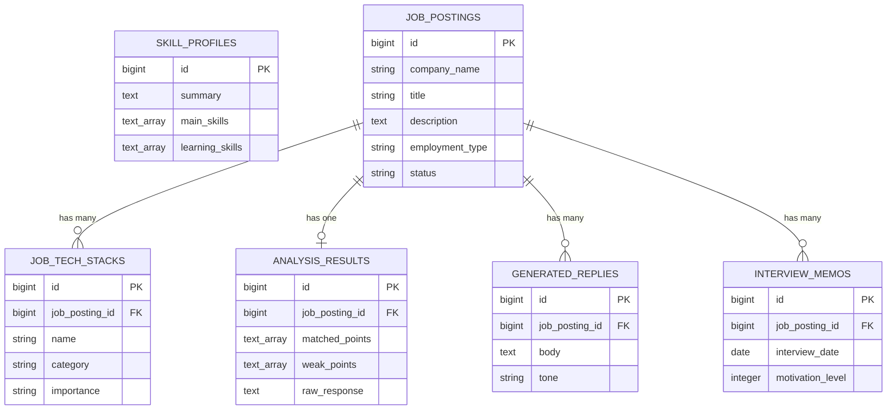

# Job Match Assistant

[](https://github.com/yuta1192/job-match-assistant/actions/workflows/backend-test.yml)
[](https://github.com/yuta1192/job-match-assistant/actions/workflows/frontend-check.yml)

求人情報とスキルプロフィールをもとに、**技術スタック抽出・マッチ分析・懸念点整理・面談質問・返信文案**を LLM API で生成し、応募ステータスと面談メモまで一元管理する転職活動支援アプリです。

> **デモURL**: （デプロイ後に記載 — フロント: Vercel / API: Render。手順は [`docs/deployment.md`](docs/deployment.md)）

> Rails 実務経験を土台に、TypeScript / React / Next.js / LLM API / Docker / CI/CD を「実装で」キャッチアップするためのポートフォリオを兼ねています。

---

## 作成背景

転職活動で複数の求人を比較する中で、次の作業に時間がかかっていました。

- 求人ごとに技術スタックを読み取る
- 自分の経験と求人要件のマッチポイントを整理する
- 不足スキル・面談で確認すべき点を洗い出す
- 企業ごとに自然な返信文を作る
- 応募状況・面談メモが散らばる

これらを LLM で効率化しつつ、モダンな技術スタックを実装で学ぶために開発しています。

---

## 技術構成

| レイヤ | 技術 |
| --- | --- |
| フロントエンド | Next.js (App Router) / React / TypeScript / React Hook Form / Zod |
| バックエンド | Ruby on Rails (API mode) / PostgreSQL / RSpec / Service Object |
| AI / LLM | OpenAI API または Anthropic API（公式 API を直接利用。LangChain 等は当面使わない） |
| インフラ / 開発環境 | Docker / Docker Compose / GitHub Actions / Vercel / Render(or Fly.io/Railway) |

> 設計方針の詳細は [`docs/design.md`](docs/design.md) を参照。

---

## 主な機能（MVP）

- 求人登録
- スキルプロフィール登録
- 技術スタック抽出（LLM）
- マッチ分析（LLM）
- 返信文生成（LLM）
- 応募ステータス管理
- 面談メモ管理

---

## リポジトリ構成

```
job_match_assistant/
├── README.md
├── docker-compose.yml        # Phase 4 で追加
├── docs/
│   ├── design.md             # 設計書（このアプリの仕様・設計意図）
│   ├── learning-plan.md      # Udemy・書籍と実装内容の対応表 / スケジュール
│   ├── ai-usage-policy.md    # Claude Code / Cursor / ChatGPT の利用方針
│   └── interview-script.md   # 面談で説明する5分スクリプト
├── backend/                  # Rails API（Phase 3 で構築）
└── frontend/                 # Next.js / TypeScript（Phase 1〜2 で構築）
    └── src/
        └── types/            # Phase 1: 主要データ型
```

---

## スクリーンショット

> デプロイ後 or `docker compose up`（http://localhost:3000）で各画面を撮影して貼る。
> 推奨: 求人一覧 / 求人詳細（分析・返信文付き）/ スキルプロフィール。
> 例: `docs/images/job-list.png` を用意し `` を追記。

## ER 図

`JobPosting` を中心に、技術スタック・分析結果・返信文・面談メモがぶら下がる構成。



> `SkillProfile` はアプリ全体で1件のみ運用（自分の情報）。分析時に `JobPosting` と突き合わせて使う。

---

## API 一覧

全エンドポイントは `/api` 名前空間。入出力は camelCase（フロントの型と一致させるため、コントローラ層で snake_case ⇄ camelCase を変換）。

| メソッド | パス | 用途 |
| --- | --- | --- |
| GET | `/api/job_postings` | 求人一覧 |
| POST | `/api/job_postings` | 求人登録 |
| GET | `/api/job_postings/:id` | 求人詳細（技術スタック含む） |
| PATCH | `/api/job_postings/:id` | 求人更新 |
| DELETE | `/api/job_postings/:id` | 求人削除 |
| GET | `/api/skill_profile` | スキルプロフィール取得 |
| POST/PATCH | `/api/skill_profile` | スキルプロフィール作成/更新 |
| POST | `/api/job_postings/:id/analyze` | **マッチ分析（LLM）** |
| GET | `/api/job_postings/:id/analysis_result` | 分析結果取得 |
| POST | `/api/job_postings/:id/generate_reply` | **返信文生成（LLM）** |
| GET | `/api/job_postings/:id/generated_replies` | 返信文一覧 |
| GET/POST | `/api/job_postings/:id/interview_memos` | 面談メモ 一覧/作成 |
| PATCH/DELETE | `/api/interview_memos/:id` | 面談メモ 更新/削除 |

---

## LLM 連携の設計

> Phase 5 で実装後に詳細を追記する。設計時点での方針:

- **入力**: 求人本文 + スキルプロフィール（構造化して渡す）
- **出力**: JSON 形式で固定（パース失敗時のフォールバックを用意）
- **エラー処理**: timeout / retry / レート制限を考慮
- **ログ保存**: `raw_response` を保存し、再現性とデバッグ性を確保
- **コスト意識**: モデル選定・トークン量・呼び出し回数を意識

---

## AI ツール利用方針

本アプリの開発では、Claude Code / Cursor を、実装案の比較、テスト観点の洗い出し、リファクタリング案の検討、README 作成補助に利用しました。

最終的な設計判断、コードレビュー、テスト、動作確認は自分で行っています。生成されたコードはそのまま採用せず、責務分割・例外処理・セキュリティ・保守性を確認したうえで取り込んでいます。

> 詳細は [`docs/ai-usage-policy.md`](docs/ai-usage-policy.md)。

---

## 学習教材との対応

| 教材 | 学習内容 | アプリで実装した箇所 |
| --- | --- | --- |
| Understanding TypeScript | type / interface / union / generics | 求人・分析・返信・ステータスの型定義（`frontend/src/types/`） |
| React(v18)完全入門 | hooks / form / component | 求人登録フォーム、求人一覧 |
| Docker 講座 | Dockerfile / docker-compose | Rails / Next.js / PostgreSQL の開発環境 |
| ChatGPT API 実践 | LLM API | 求人分析・返信文生成 |
| GitHub Actions 講座 | CI | RSpec 自動実行 |

> 完全な対応表とスケジュールは [`docs/learning-plan.md`](docs/learning-plan.md)。

---

## セットアップ

### Docker で一括起動（推奨）

```bash
cp .env.example .env        # PostgreSQL の認証情報（初回のみ）
docker compose up           # db / backend / frontend を起動（初回はビルド）
```

- フロント: http://localhost:3000
- API: http://localhost:3001
- 初回起動時に backend が自動で DB 作成・マイグレーション・シードを実行します。
- db コンテナのポートはホストに公開していません（ローカルの PostgreSQL と衝突しないため）。

構成: ルートの `docker-compose.yml` が `db`(postgres:16) / `backend`(`backend/Dockerfile.dev`) / `frontend`(`frontend/Dockerfile.dev`) を起動します。コードは volume マウントでホットリロードされます。

### Docker を使わない場合（ローカル直起動）

別々のターミナルで:

```bash
cd backend && bin/rails s    # → http://localhost:3001（既定ポート 3001）
cd frontend && npm run dev   # → http://localhost:3000
```

ローカル直起動では Rails は Unix ドメインソケットで PostgreSQL に接続します（`config/database.yml` は環境変数が無ければソケット接続）。

### デプロイ

フロントエンドを **Vercel**、バックエンド(API)と PostgreSQL を **Render**（ルートの `render.yaml` Blueprint）にデプロイします。手順は [`docs/deployment.md`](docs/deployment.md) を参照。

> CI: push / PR で GitHub Actions が RSpec（backend）と型チェック/Lint/build（frontend）を自動実行します。

---

## 今後の改善

認証 / 求人 URL 自動取得 / FastAPI 切り出し / RAG / Go バッチ処理 / Terraform / AWS 本格デプロイ / Playwright E2E。
